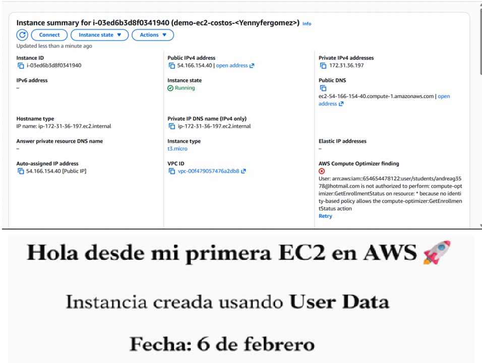
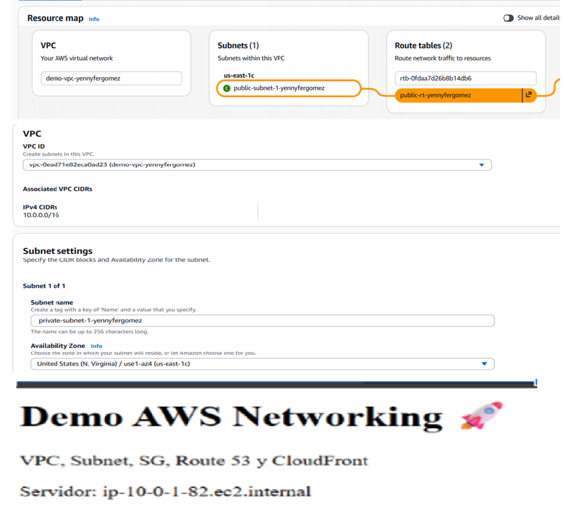
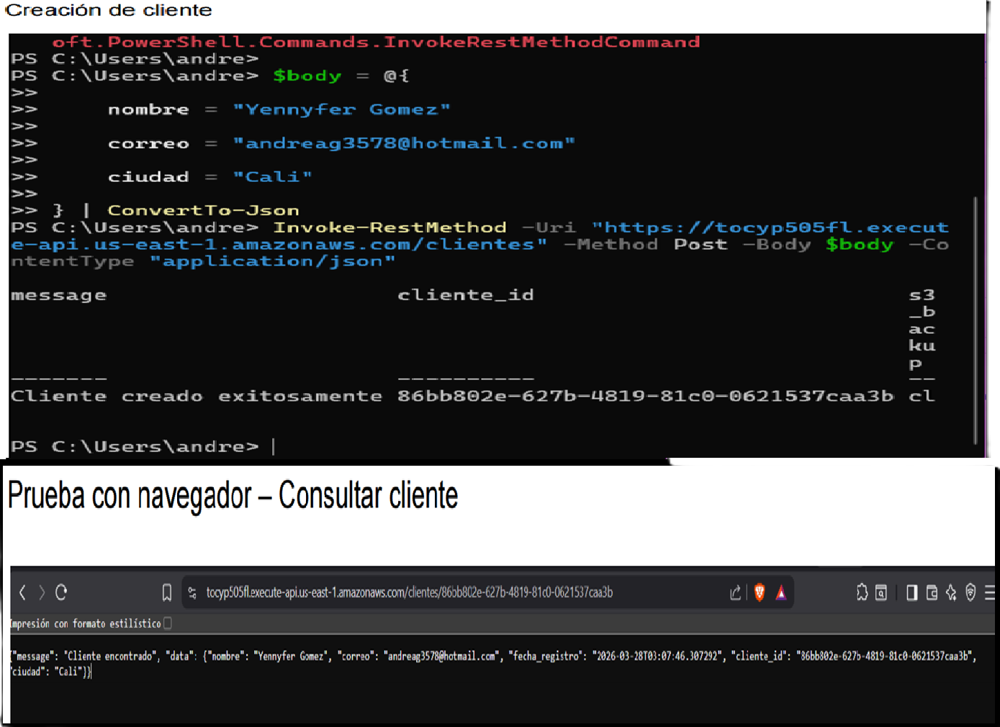

# AWS Networking & Compute Infrastructure 🌐💻

Este repositorio contiene la implementación de arquitecturas de red y administración de instancias de cómputo, enfocándose en la alta disponibilidad, seguridad y conectividad.

---

## 🏗️ 1. Amazon EC2 & Auto Scaling
Implementación y administración de servidores virtuales en la nube.

* **Logros:**
    * Lanzamiento y configuración de instancias **EC2** (Linux/Windows).
    * Gestión de pares de claves (Key Pairs) y acceso mediante SSH/RDP.
    * Configuración de **Security Groups** para control de tráfico de red.
    * Implementación de almacenamiento elástico con **Amazon EBS**.

> **Evidencia:**
> 

---

## 🌐 2. Networking & Conectividad Avanzada
Diseño de redes lógicas aisladas mediante **Amazon VPC**.

* **Habilidades demostradas:**
    * Creación de Subnets públicas y privadas.
    * Configuración de **Internet Gateways** y NAT Gateways.
    * Implementación de **VPC Peering** para conectar redes distintas.
    * Gestión de tablas de ruteo (Route Tables) para control de flujo de datos.

> **Evidencia:**
> 

---

## 📐 3. Arquitectura Aplicada
Este apartado se enfoca en el diseño de soluciones siguiendo el **AWS Well-Architected Framework**, priorizando la alta disponibilidad y la eficiencia de costos.

* **Análisis realizado:** Se evaluó una infraestructura Multi-AZ para garantizar la resiliencia del sistema ante fallos de infraestructura física.
* **Componentes clave:** Implementación de Balanceadores de Carga (ALB) y estrategias de escalado horizontal.

> **Diseño de la Solución:**
> 

---

## 🛠️ Servicios Utilizados
* **Cómputo:** Amazon EC2, Amazon Machine Images (AMI).
* **Redes:** Amazon VPC, Subnets, Route Tables, Internet Gateway.
* **Seguridad:** Security Groups, Network ACLs.

---
*Este proyecto demuestra mi capacidad para construir y administrar el esqueleto fundamental de la nube de AWS.*
